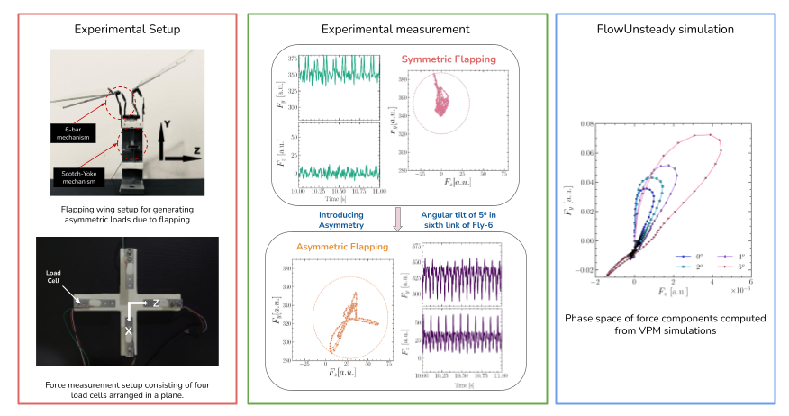

# Dummy Notes Entry

This example note shows the new Markdown-based reading mode for `note.html`. You can write short reading notes, teaching material, research reflections, or lab documentation in one file.

## Why this format is useful

- It is much easier to edit than nested JavaScript objects.
- It supports standard Markdown headings and lists.
- It can include equations, code blocks, images, GIFs, and embedded HTML.
- It keeps the Blog page card simple while letting the article page be richer.

## Example equation

Inline math works like this: $x_{k+1} = Ax_k + Bu_k$.

Display math works too:

$$
\dot{x} = f(x, u), \qquad
y = h(x)
$$

## Example code block

```python
import numpy as np

def propagate_state(A, B, x, u):
    return A @ x + B @ u

x_next = propagate_state(A, B, x, u)
print(x_next)
```

## Example callout

> This page is intended to feel closer to a lightweight Medium or HackMD-style note, while still staying inside your portfolio website.

## Example image

You can place images relative to the markdown file or use assets already in the project:



## Example embedded video or GIF

Markdown will render inline HTML too, so you can embed richer media like this:

```html
<video controls width="100%">
  <source src="./demo.mp4" type="video/mp4" />
</video>
```

For GIFs, you can simply use normal Markdown image syntax:

```md

```

## Example references

1. Brunton, S. L., and Kutz, J. N. _Data-Driven Science and Engineering_.
2. Koopman, B. O. "Hamiltonian systems and transformation in Hilbert space."

## Editing workflow

If you want a note to use article mode:

1. Add a `slug` in `blog-data/blog-data.js`.
2. Add `markdown: "./blog-data/articles/your-file.md"`.
3. Keep a `Read Article` action linking to `./note.html?slug=your-slug`.
4. Optionally keep an `Open PDF` action too.

### Minimal example

```js
{
  slug: "koopman-notes",
  title: "Koopman Notes",
  meta: "Reading Notes",
  description: "Notes on Koopman operator methods.",
  markdown: "./blog-data/articles/koopman-notes.md",
  actions: [
    {
      title: "Read Article",
      href: "./note.html?slug=koopman-notes",
      background: "#dceddf",
      color: "#1f2b35",
    }
  ]
}
```
